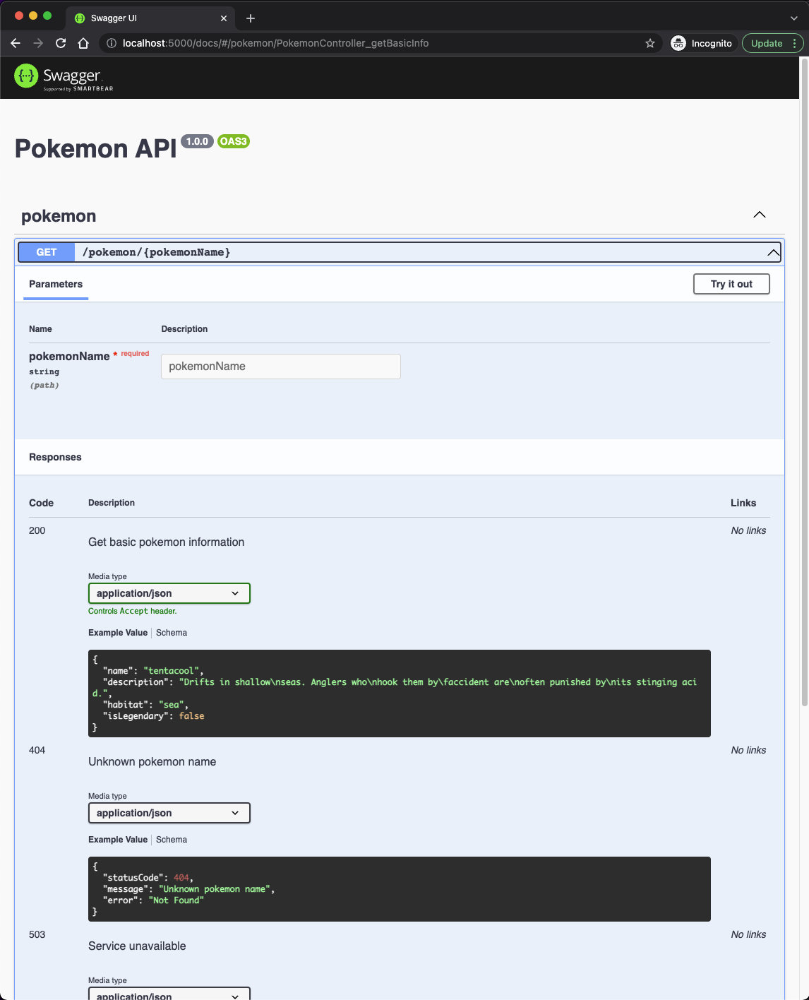

# Pokedex

## Description

This project provides an API for querying Pokemon information, using [PokeAPI](https://pokeapi.co). Also, you can get fun translations for the available properties.

## Prerequisites

Make sure you have installed all of the following prerequisites on your development machine:

- Git
- Node.js (v16.13.0)
- NPM (v8.1.0)

## Installation

```bash
$ git clone https://github.com/andreiv05/pokedex.git

$ cd pokedex

$ npm install
```

## Running the app locally

```bash
$ npm run start
```

This will start a local HTTP server on the specified port in the `.env` file (default is 5000).

## Running the app with Docker

```bash
$ docker build . -t pokedex

$ docker run -p 5000:5000 -d pokedex
```

## API Documentation - Swagger

The API documentation is dinamically generated from the Typescript interfaces and can be found on the `/docs` endpoint. For local deployment: `http://localhost:5000/docs`



## Environment configuration

The app is configured via environment variables. For local deployment, you can use the `.env` file. Defaults value used:

- PORT=5000
- POKEAPI_BASE_URL="http://pokeapi.co/api/v2"
- TRANSLATOR_BASE_URL="https://api.funtranslations.com"

## Caching

The external API used [PokeAPI](https://pokeapi.co) serve static assets, so we can cache the response for an improved user experience and a lower use of computational power. When we have a cache hit the response time decrease from `~450ms` to `~6ms`. The cache system use the URL as the resource identifier.

Currently, only responses for the `/pokemon/:pokemonName` endpoints are cached. We don't use caching for the `/pokemon/translated/:pokemonName` endpoint because we don't have the guarantee that we will receive the same translation, providing the same input for [FunTranslationAPI](https://funtranslations.com/api/)

## Unit tests

We have 100% coverage on Controllers and Services, covering all the critical components that have business logic or handle the lifecycle of the request.

```bash
------------------------|---------|----------|---------|---------|-------------------
File                    | % Stmts | % Branch | % Funcs | % Lines | Uncovered Line #s
------------------------|---------|----------|---------|---------|-------------------
All files               |     100 |      100 |     100 |     100 |
 controllers            |     100 |      100 |     100 |     100 |
  index.ts              |     100 |      100 |     100 |     100 |
  pokemon.controller.ts |     100 |      100 |     100 |     100 |
 services               |     100 |      100 |     100 |     100 |
  index.ts              |     100 |      100 |     100 |     100 |
  pokeapi.service.ts    |     100 |      100 |     100 |     100 |
  pokemon.service.ts    |     100 |      100 |     100 |     100 |
  translator.service.ts |     100 |      100 |     100 |     100 |
------------------------|---------|----------|---------|---------|-------------------

Test Suites: 4 passed, 4 total
Tests:       16 passed, 16 total
Snapshots:   0 total
Time:        2.883 s, estimated 3 s
```

If you want to run the unit tests suite:

```bash
# Run the unit test
$ npm run test

# Run coverage
$ npm run test:cov
```

## Integration tests (E2E)

We have integrations tests in order to test the external services used: [PokeAPI](https://pokeapi.co) and [FunTranslationAPI](https://funtranslations.com/api/).

```bash
 PASS  test/app.e2e-spec.ts (6.87 s)
  PokemonController (e2e)
    ✓ /pokemon/:pokemonName (GET) (778 ms)
    ✓ /pokemon/translated/:pokemonName (GET) - yoda translation (3244 ms)
    ✓ /pokemon/translated/:pokemonName (GET) - shakespeare translation (779 ms)

Test Suites: 1 passed, 1 total
Tests:       3 passed, 3 total
Snapshots:   0 total
Time:        6.95 s
Ran all test suites.
```

If you want to run the integration tests modules:

```bash
npm run test:e2e
```

## Production checklist

- Currently, the [FunTranslationAPI](https://funtranslations.com/api/) have very strict ratelimiting (60 API calls a day distribution of 5 calls an hour). Depending on use, we may need to upgrade to their plaid plan.
- Integration with a monitoring system(e.g. DataDog, Prometheus) for resource consumption, stacktraces, error rate and so on.
- Alerts configure based on the multiple metrics. Some examples:
  - CPU / memory consumption
  - Traffic increase
  - Size of the deployed artifact
- Healthcheck endpoint and probes for orchestrators
- Graceful shutdown, for example handling the SIGTERM signal
